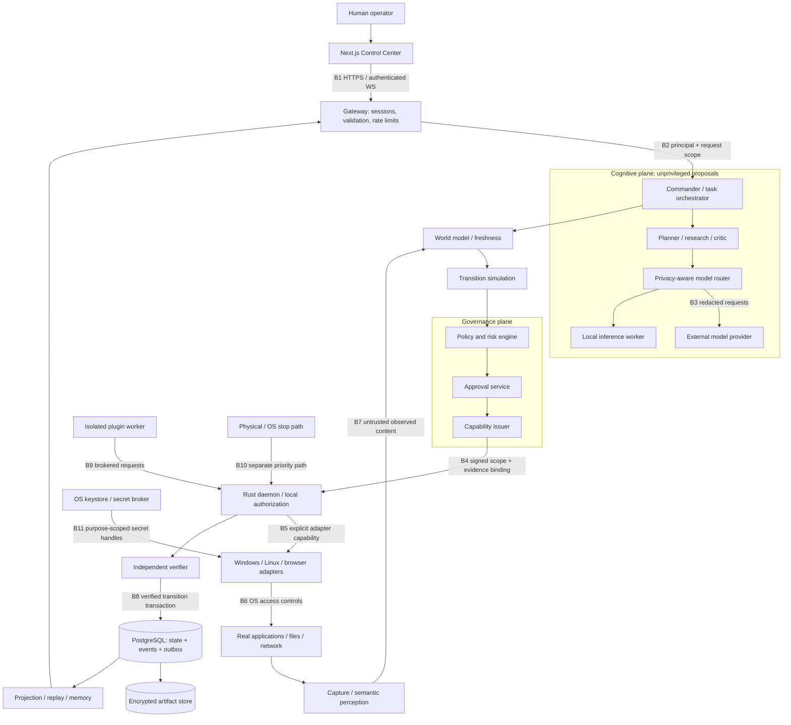
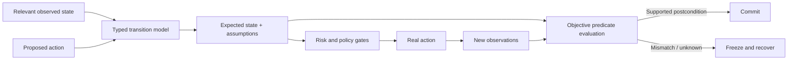
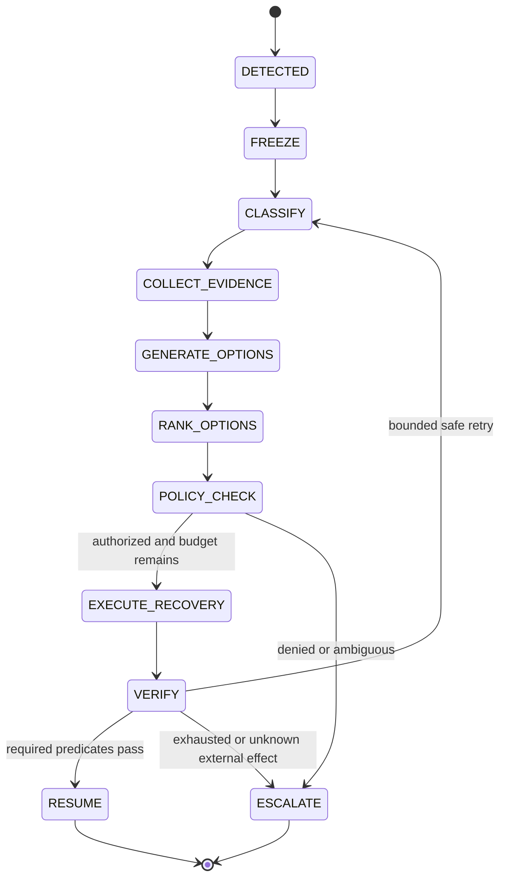

# JARVIS X: verified autonomous computer operating fabric

Design baseline: 2026-09-12. Scope: Windows first, Linux through explicit adapters, one interactive desktop per device.
This document reconciles both supplied specifications; the expanded JARVIS X specification determines the 28-section structure.
All numerical allocations are initial engineering budgets, not benchmark results or hardware guarantees.

## 1. Executive Architecture

JARVIS X separates proposals from permission and execution from proof.
Its governing sequence is `PERCEIVE → MODEL → REASON → PLAN → AUTHORIZE → EXECUTE → OBSERVE → VERIFY → COMMIT`.
A model response can propose an action; it cannot grant a capability, validate its own effects, or lift an emergency latch.
Success means a declared, independently evaluated postcondition holds against attributable evidence.
An unobservable external effect is `UNKNOWN`, even if the model sounds certain or an API returns HTTP 200.

### Delivery labels

| Label | Meaning in this repository |
|---|---|
| REAL IMPLEMENTATION | Existing Python application and newly added executable source; scope is stated per module |
| REFERENCE IMPLEMENTATION | TypeScript orchestration and virtual filesystem simulation; Rust guarded daemon and transport foundation |
| PLATFORM-SPECIFIC | Native capture/input integrations depend on OS sessions, permissions, compositor, and installed libraries |
| OPTIONAL | Vector extension, remote inference, distributed workers, shared-memory transport, hardware stop device |
| EXPERIMENTAL | Digital twin prediction, consensus calibration, learned routing, automatic workflow induction |
| PRODUCTION TARGET | A specified interface or hardening gate whose implementation/operational validation remains outstanding |

No part of this delivery is represented as a certified production autonomous operating system.
The TypeScript reference keeps events, capabilities, and memory in process; the supplied PostgreSQL schema is not wired into that loop.
The Rust reference is a separate protocol endpoint; the dashboard demonstration does not silently operate the real desktop through it.
Existing `app/`, `core/`, and Python launch/setup paths remain available while the new target is introduced alongside them.

### Five planes

| Plane | Owns | Cannot own |
|---|---|---|
| Cognitive | Intent, planning, routing, critic summaries, uncertainty | Credentials, authority, direct OS handles |
| Perception | Frames, DOM/UIA/AT-SPI, processes, file/network observations | Inferred observations masquerading as measurements |
| Execution | Typed operations, bounded processes, native adapters | Policy issuance or expansion of granted scope |
| Governance | Identity, policy, approval, capabilities, stop and audit | Replacing failed verification with model confidence |
| Memory/evidence | Attributable events, snapshots, retrieval, retention | Turning stale memory into current permission |

**Choice:** a modular control runtime plus a separate Rust executor.
**Why:** the privilege boundary is valuable before distributed services are necessary.
**Tradeoff:** module isolation in one TypeScript process is organizational, not a security sandbox.
**Failure:** a compromised runtime can propose malicious work; the independently configured daemon must still refuse it.
**Security:** only a bounded capability crosses into execution. **Performance:** local orchestration avoids unnecessary network hops.

## 2. System Topology



Control flow and observation flow use different message types and permissions.
The topology is the target deployment; reference modules are consolidated under `services/runtime` and `packages/contracts`.
For the initial machine, use one gateway/orchestrator process, one daemon, one database, and isolated inference workers.
Split planner, memory, policy, recovery, router, and telemetry into processes only for independent privilege or scaling needs.
The Next.js process never holds native input handles or the daemon's signing authority.

**Choice:** keep bulky artifacts outside transactional rows.
**Why:** frame payloads otherwise amplify database backups and event queries.
**Tradeoff:** object storage and row commits need a lifecycle protocol; an object and row cannot be atomically committed together.
**Failure:** uploaded but unreferenced artifacts become garbage; missing referenced objects make evidence unavailable.
**Security:** use encryption and access-scoped object retrieval. **Performance:** small indexed metadata keeps event queries bounded.

## 3. Trust Boundaries

| Boundary | Threat | Required enforcement | Failure posture |
|---|---|---|---|
| B1 Browser → gateway | Cross-site requests, stolen session, forged WS client | Exact origins, CSRF for cookie mutation, session expiry, body limits, scoped subscriptions | Reject unauthorized request; never rely on localhost alone |
| B2 Gateway → runtime | Confused deputy or cross-user task ID | Propagate authenticated subject; authorize object access on each read/write | Deny mismatched task/device/owner |
| B3 Router → provider | Sensitive export and malicious completion | Classification, redaction, egress allowlist, provider contract, strict output schemas | Local route or no execution |
| B4 Runtime → daemon | Forged, replayed or overbroad requests | Mutual auth, independent policy, task/action binding, expiry, nonce, sequence, quotas | Reject and audit |
| B5 Daemon → adapters | Plugin privilege inheritance | Explicit capability handles, argument schemas, resource boundaries | Unsupported/denied action |
| B6 Adapter → OS | Privilege elevation and wrong target | Ordinary user token, path/handle checks, process identity and session binding | Respect denial; no escalation fallback |
| B7 Environment → world model | Prompt injection in documents/DOM/OCR | Source labels, taint, bounded parsers, evidence identifiers | Content remains data |
| B8 Runtime → database/store | Forged history, insecure raw evidence | Separate database roles, immutable event rows, transaction/outbox, artifact ACLs | Stop mutations when durable admission unavailable |
| B9 Plugin → broker | Arbitrary code or undeclared egress | Separate worker, deny-by-default grants, signed manifest, time/memory/output limits | Kill/quarantine worker |
| B10 Stop source → daemon | Scheduler/model deadlock or malicious resume | Dedicated local path, persistent latch, emergency epoch, explicit re-arm | Remain stopped |
| B11 Secret broker → tool | Credential logging or broad reuse | Purpose-specific reference, short lease, process-local exposure, zero logging | Refuse unavailable secret |
| Device → device/network | Impersonation and stale replicas | Device enrollment, pinned identity, revocation, fencing and timestamps | No distributed authority on lost quorum |
| Update source → installation | Substituted or downgraded binaries | Signed digest, provenance, release channel, rollback compatibility | Keep previous verified version |
| Administrator → platform | Host compromise, disabled audit, kernel compromise | External audit anchoring and host hardening | Outside local cryptographic guarantees |

Untrusted sources include browser pages, plugin output, search results, imported memory, OCR, terminal text, and model messages.
Instruction-looking text from those sources is never promoted into policy, user consent, or a secret request.
The model provider is not an identity provider and cannot choose the execution principal.
Approval reviewers see exact effect, target, risk, scope, and expiry; free-form model descriptions alone are insufficient.
Control APIs and artifact endpoints must both check ownership; hiding a link in the UI is not authorization.

## 4. Multi-Agent Architecture

The Commander delegates typed jobs with bounded budgets, rather than running twelve always-on model instances.
Roles are logical workers; most deterministic checks run without an LLM.

| Role | Input | Output | Authority |
|---|---|---|---|
| Commander | Intent, task state, budget | Versioned DAG and assignments | Schedule allowed work |
| Planner | Goal, verified state, constraints | Candidate plan and explicit assumptions | Propose |
| Research | Bounded query, allowed sources | Claims with source references | Read approved sources |
| Vision | Redacted frame/ROI | Candidates and source uncertainty | Observe |
| Grounding | Candidates, UI identity, transforms | Bound target or ambiguity | Resolve, never click |
| Execution | Valid action and capability | Delivery/result record | Broker only |
| Verification | Predicate and new evidence | SUCCESS/PARTIAL/FAILED/UNKNOWN/UNSAFE | Evaluate predicate |
| Security | Typed proposal and policies | Allow, deny, approval requirement | Policy evaluation; model advice nonbinding |
| Recovery | Incident and budgets | Ranked repair/compensation plan | Propose repair |
| Memory | Verified result and references | Scoped memory records | Store/retrieve redacted facts |
| Critic | Proposed claim/evidence | Contradictions and unsupported assumptions | Challenge proposal |
| Resource | Measured load and reservations | Admission/throttle decision | Lower concurrency |

Messages carry schema version, task/plan/node IDs, sender role, recipient, correlation ID, deadline, budget, and typed payload.
The receiver validates again; role names embedded in model output cannot spoof the authenticated sender.
Deadline and action/model/recovery budgets propagate to child jobs, and cancellation propagates in the opposite direction.
Independent branches can reason concurrently; only one writer owns a desktop focus lease.
Condition nodes choose declared edges; loops are unrolled into bounded plan versions, so persisted execution remains a DAG.

### Consensus is a disagreement detector

Use independent evidence collection or different failure modes, not three identical prompts treated as three independent votes.
For high-impact proposals, collect A's hypothesis, B's independent analysis and C's critique as structured claim/evidence records.
Reject unsupported claims and contradictory preconditions before computing agreement.
Correlated models can unanimously be wrong; majority vote does not establish truth or satisfy authorization.
Do not average unrelated confidence values into a pseudo-probability.
On disagreement: freeze that node, re-observe, obtain missing evidence, try one stronger allowed route, then escalate within budget.
Consensus never bypasses a denied policy, required approval, missing target binding, or failed objective verification.

**Choice:** specialized roles sharing strict contracts.
**Why:** reviewable responsibilities and constrained outputs. **Tradeoff:** coordination overhead and repeated context.
**Failure:** circular delegation or correlated model errors. **Security:** no role can mint authority from text.
**Performance:** serialize local inference; reserve parallelism for independent I/O or permitted cloud requests.

## 5. World Model

Persist observations as immutable facts and derive a replaceable latest-state projection.
An observation records `observed_at`, `source`, `confidence`, `expires_at`, `frame_id`, `state_version`, boot ID and monotonic timestamp.
Dependencies identify which display, window, DOM document, process, file version, or network transaction makes a fact valid.
The graph represents Computer, Display, Window, Application, Process, File, Network, InputState, Browser, UIElement, Task, Environment.
Useful identity tuples include process PID plus creation time, window handle plus owner PID, and tab ID plus navigation generation.
Never identify a process by PID alone after restart or a page by its previous URL after navigation.

| Observation class | Initial freshness ceiling | Invalidation |
|---|---|---|
| Coordinate click target | 250 ms from final capture | Focus/layout/scroll/display or DPI change |
| Semantic target | 1 s, then re-resolve immediately before action | Document/window generation change |
| Process status | 1 s for control, 5 s for display | Exit/start event or creation-time mismatch |
| File precondition | Recheck at opened handle | File ID/content/version differs |
| Network reachability | 5 s for routing | Endpoint-specific request failure |
| Resource sample | 1 s admission input | Missing samples or allocation failure |
| Stored preference | Explicit version; no implicit permission | User change, expiry, scope mismatch |

These are starting policy ceilings; each adapter can require stricter limits.
Freshness uses a monotonic clock within a boot; wall time is for correlation and retention.
A new boot ID invalidates old monotonic readings; clock synchronization never makes old evidence fresh.
Unknown future timestamps or impossible generation changes cause rejection, not a negative age treated as fresh.
Latest-world version alone is insufficient: revalidate only the dependencies relevant to the proposed effect.
Canonical hashes cover stable fields plus schema version; exclude transient timestamps from semantic equality.
Use an established canonical form such as [RFC 8785](https://www.rfc-editor.org/rfc/rfc8785) when exchanging signed JSON digests.
Hash equality detects identical encoded content, not completeness or truth of a model's world representation.

**Choice:** evidence graph plus projections. **Why:** preserve provenance while permitting fast reads.
**Tradeoff:** invalidation logic is harder than one global screenshot.
**Failure:** omitted dependency permits stale execution; test focus/navigation races explicitly.
**Security:** memory cannot overwrite measured facts. **Performance:** relevant-subgraph hashing avoids whole-machine scans.

## 6. Digital Twin

The twin is a bounded transition model, not an accurate clone of arbitrary applications.
It simulates known adapter semantics using the current relevant state and declared side effects.
For a file write, model parent directory existence, previous content hash, free space, atomic rename and rollback artifact.
For a form submit, model required fields, navigation outcome, external side effect, ambiguous delivery and unavailable compensation.
Simulation uses fixtures or disposable application sandboxes; it must not send a real payment/email while called a dry run.
Predictions carry assumptions and unsupported transitions so policy can require observation or approval.



Prediction error is measured against evidence after execution; a plausible twin output cannot count as verification.
Record versioned simulation inputs and outputs, adapter version and random seed for reproducible fixture replay.
Installation planning includes OS/disk/network checks, download digest/signature, permission, installation, configuration and launch predicates.
The reference virtual filesystem is one narrow simulator; UI twins and external application models are production work.

**Choice:** lightweight deterministic transitions first. **Why:** actionable safety checks without pretending to simulate all software.
**Tradeoff:** limited coverage. **Failure:** an undocumented external effect invalidates the prediction.
**Security:** simulation has no live capability by default. **Performance:** simulation must fit the node budget or abstain.

## 7. Perception Architecture

Pipeline: Capture → adaptive resolution → preprocess → OCR → detection/segmentation → classification → semantic fusion → scene graph.
Prefer DOM and accessibility when they expose the needed information; use vision to fill gaps and check spatial context.
Fuse sources using identity, bounds, window/tab/document generation and observation time, rather than nearest pixel alone.
OCR agreement with a screenshot is often correlated evidence, because OCR consumed that same screenshot.
The grounder rejects multiple plausible targets, invisible/disabled controls, occluded points and focus mismatches.
For sensitive input, verify the destination type and window identity before even leasing the secret.

### Capture and temporal control

Capture monitor/window/region, cursor metadata, display origin, physical pixels, logical scale and transform version.
Multi-monitor origins may be negative; coordinates must identify their coordinate space and monitor.
Store transforms explicitly; high-DPI conversion and mixed-scale monitors must round predictably and remain in bounds.
Use at most four 1920×1080 RGBA frames per active stream: 31.64 MiB before overhead, with a separate bounded encoded queue.
Three 3840×2160 RGBA frames consume about 94.92 MiB; admit this mode only by replacing the default reservation.
Drop superseded frames at ingestion, deduplicate hashes, and retain evidence frames around an action according to policy.
Idle capture starts at 1 FPS; active regions at 5 FPS; short transitions up to 10 FPS within budget.
These rates are configuration targets; platform capture and display refresh impose actual limits.

Track `UI_STABLE`, `UI_TRANSITIONING`, `UI_UNKNOWN` using multiple frames and semantic change events.
Default stabilization means three consistent relevant observations over at least 200 ms, with a bounded wait of 2 s.
Ignore irrelevant blinking cursors only through a documented mask; a success dialog cannot be masked as animation.
Timeout produces unknown state; do not wait forever for a web page with a permanent animation.
Resize/ROI changes invalidate coordinate transforms and cached detections.

### Browser and native adapters

The browser adapter covers tabs/windows, navigation, forms, inputs, dialogs, frames, DOM, accessibility, downloads/uploads, and network state.
Prefer role/name and stable semantic locators; bind them to the correct document/frame and verify uniqueness.
Closed shadow roots and inaccessible cross-origin frame internals remain unsupported unless a legitimate API exposes them.
Arbitrary JavaScript requires a separate high-scope capability; do not elevate ordinary DOM reads into script execution.
Downloads require provenance, bounded size, malware scanning policy and digest checks before execution; uploads require exact file authorization.
Native adapters match application fingerprint/version and expose operations such as save_document, find_text, read_table and export_data.
If the specialized adapter is unavailable, fall back only to an equally authorized and verifiable generic operation.
CAPTCHA, authentication, secure desktop and endpoint controls produce a stop or human handoff, never a bypass.

**Choice:** semantic-first fusion plus temporal evidence. **Why:** robust identity and lower perception cost.
**Tradeoff:** application accessibility quality varies. **Failure:** stale layout or mislabeled controls.
**Security:** observed text stays untrusted. **Performance:** ROI, bounded frames and event-driven refresh reduce GPU/CPU work.

## 8. Action Architecture

Each action contains identity/type, target, typed parameters, preconditions, expected state, risk, confidence, required capabilities,
timeout, verification strategy, rollback classification, evidence requirement, and idempotency key.
Action type selects a closed parameter schema; no opaque `command` field becomes a general shell escape hatch.
Executor admission order: stop latch → authentication → envelope/schema → freshness → policy → capability → budget → target binding.
Immediately before the effect, recheck cancellation, relevant preconditions and capability validity under the same target lease.
After any focus-affecting operation, release stale target references and observe again.

### Terminal and process broker

Represent an executable by configured ID, canonical path and digest, with a validated argv vector, cwd, environment allowlist and timeout.
Use direct process spawning; shell interpretation is a distinct denied-by-default capability.
An allowlisted executable can still interpret scripts or launch children, so executable allowlisting alone is not a sandbox.
Prevent traversal, symlink/reparse substitution and time-of-check/time-of-use races with opened handles and OS-specific policies.
Record redacted argv, cwd identity, environment policy ID, approval, policy result, exit code, duration and bounded stdout/stderr.
Read stdout and stderr concurrently, stream bounded chunks, enforce a total byte limit and terminate on deadline/cancellation.
Production process containment requires Windows job objects or Linux cgroups/namespaces; the reference does not claim this containment.
Dry-run reports the exact executable/arguments and expected effects but never claims to prove arbitrary process behavior.

### Delivery, idempotency and compensation

A database idempotency key prevents duplicate local admission; it cannot make a remote UI operation exactly once.
After submit succeeds remotely but acknowledgement is lost, the correct result is `UNKNOWN` until reconciled by an authoritative read.
Retry only when the side effect is known absent or the target API itself supports a stable idempotency key.
Prefer desired-state actions: check whether saved, save if necessary, then independently inspect persisted output.
Classify rollback as REVERSIBLE, PARTIALLY_REVERSIBLE, IRREVERSIBLE or UNKNOWN before authorization.
File rollback checks current content against the expected written digest before restoring a version; otherwise it could overwrite human changes.
Stopping a newly spawned process cannot undo emails or files it already produced; compensation is a new authorized action.
UI Back and Undo are not universal rollback; they require adapter-specific postconditions and an uncontested state version.

**Choice:** typed intent plus broker. **Why:** audit and enforce specific effects.
**Tradeoff:** more adapter work than raw shell automation. **Failure:** a permitted tool has broader semantics than its declared contract.
**Security:** deny shell and elevation by default. **Performance:** bounded direct process I/O avoids terminal parsing overhead where possible.

## 9. Verification Architecture

The verifier consumes declared predicates and post-action observations produced by a separate observation path.
It may use model perception to locate evidence, but a model statement that a task succeeded cannot itself establish success.
All required predicates must pass; confidence thresholds never substitute for a missing measurement.
Verification returns SUCCESS, PARTIAL_SUCCESS, FAILED, UNKNOWN or UNSAFE with evidence references and measured values.
Commit task progress and reusable memory only after required postconditions pass.
Partial completion records exactly which effects are verified and blocks dependent nodes whose inputs remain unproved.

| Effect | Objective predicate | Insufficient signal |
|---|---|---|
| Write report | Read target file through authorized handle; compare hash/content/format | Save button clicked |
| Start process | New PID plus creation time and expected readiness probe | Spawn call returned |
| Stop process | Same process identity gone and required children contained | Terminate request accepted |
| Submit form | Authoritative record ID/read-back matches submitted values | Toast or HTTP 200 alone |
| Navigate | Correct tab/frame generation, URL policy and required page marker | Address-bar text changed |
| Install package | Signature/digest plus exact installed version and launch probe | Installer exit code alone |
| UI selection | Accessibility/DOM selected state plus target identity | Cursor overlaps label |
| External publication | Read-back from intended destination with artifact digest/version | Local build succeeded |

Confidence components remain separate: perception, grounding, action evidence and verification evidence.
Initial low-risk policy may permit scores ≥0.95, require stronger evidence at 0.80–0.95, re-observe at 0.60–0.80, and refuse below 0.60.
These numbers are configurable routing gates, not calibrated probabilities or guarantees of correctness.
High-risk actions additionally require objective preconditions, exact scope and the configured human authorization.
Calibration requires labeled domain datasets, reliability curves and false-positive analysis; until then, display scores as estimates.

**Choice:** declarative independent predicates. **Why:** define what success actually means.
**Tradeoff:** some application effects are unobservable. **Failure:** false-positive verifier commits wrong state.
**Security:** uncertain high-impact results freeze execution. **Performance:** adaptive polling with deadline avoids unnecessary full-screen inference.

## 10. Recovery Architecture



Freeze the affected task/device input lease first; capture fresh evidence before naming a root cause.
Recovery uses the same policy, capability and verification path as normal execution.
Default repair budget is two attempts per failure, three failures per task and 120 seconds total repair time; scope-specific policies may be stricter.
Use exponential backoff with jitter for retryable reads, with one total deadline and a circuit breaker per endpoint/tool.
Repeatedly clicking after a timeout is not a repair strategy.
Options rank by reversibility, evidence support, scope, cost and probability of making the state more observable.

Checkpoints contain plan/DAG status, world hash, memory references, relevant artifacts, policy versions and resource state.
They never contain reusable bearer tokens; after restart, re-authenticate, re-observe, re-authorize and reconcile outstanding actions.
The daemon's local journal distinguishes intent accepted, effect started, effect returned and independently verified.
If it crashes after effect start, mark the action UNKNOWN and query the target before scheduling another effect.
Database outage blocks new mutations; emergency stop remains available and persists locally for later reconciliation.
The prototype process-local state does not implement this durable restart protocol; that is a release gate.

**Choice:** finite repair state machine plus checkpoints. **Why:** make failure handling inspectable and bounded.
**Tradeoff:** more pauses when real-world outcomes are ambiguous.
**Failure:** stale checkpoint restores authority or duplicates effects; prohibit both by renewed authorization and reconciliation.
**Security:** recovery cannot gain privilege. **Performance:** budgets prevent storms during correlated outages.

## 11. Security Architecture

Capability scope binds subject, device, task, action digest, resource identity, operation, expiry, issuer, policy version and audit ID.
An authorization result is not portable to a different plan/action/target; every meaningful modification invalidates the old binding.
Short-lived capabilities use single-use admission where practical, explicit revocation and a device emergency epoch.
The daemon checks its own allow policy even when the control plane says the action is allowed.
The reference TypeScript HMAC issuer keeps an issued-token map; the Rust endpoint uses mutually authenticated transport and local grants.
These are separate reference mechanisms and must be unified through a tested cross-language capability protocol before desktop integration.

### Secrets, privacy and evidence

Classify data PUBLIC, INTERNAL, PRIVATE, SENSITIVE or RESTRICTED before routing or persistence.
Use the OS credential store or dedicated vault; database rows hold secret references, not credential values.
Secret exposure requires a purpose-bound tool lease and must exclude prompts, memory, ordinary logs and analytics.
Mask protected UI fields before frames enter cloud inference or shared telemetry; redact tokens and personal data from text as well.
Redaction can fail to recognize a secret; for restricted applications, block capture/export or require a verified exclusion mask.
Keep raw frames ephemeral by default; quarantine explicitly required originals in encrypted, access-controlled evidence storage.
Hash the redacted artifact actually retained, record the redaction policy/version and preserve a nonsecret link to the observation.
Retention deletion of artifact bytes leaves a tombstone; replay indicates missing evidence instead of inventing it.
Encryption at rest and TLS do not protect data already exposed to an authorized but compromised application process.

### Emergency path

Provide a physical key/button input or OS hotkey handled by a dedicated local supervisor/watchdog, separate from normal dispatch.
Stop increments an emergency epoch, latches disabled execution, cancels current futures, releases injected keys/buttons and rejects queued work.
It then terminates controlled automation processes where safe, persists a local emergency record, and attempts async audit delivery.
This path must work without LLM, database, Internet, WebSocket, or the ordinary task scheduler.
Explicit human re-arm through a separate privileged local control is required; models and plugins cannot clear the latch.
The Rust reference atomic stop/cancellation mechanism covers its process and cooperative operations; hardware integration is a target.
An OS hotkey still depends on the OS; a USB button still depends on its controller/driver and supervisor.
For stronger independence, an external watchdog can cut a dedicated automation-input interface or remove its authorization lease.
No software stop can retract an already sent network request or guarantee response during kernel freeze, power failure or arbitrary driver hang.
Measure stop-to-last-effect latency under load and document noninterruptible platform calls; do not promise instantaneous universal reversal.

**Choice:** independent capability and stop enforcement. **Why:** model/runtime failures must not silently grant OS power.
**Tradeoff:** enrollment, revocation and key lifecycle complexity. **Failure:** stolen signing key or same-user process compromise.
**Security:** compartmentalize keys and limit grants. **Performance:** local validation avoids cloud/DB dependency on the stop path.

## 12. IPC

| Candidate | Latency/reliability | Security | Complexity/observability | Platform fit |
|---|---|---|---|---|
| gRPC | Efficient typed RPC/streaming; reconnect semantics still application work | mTLS and per-RPC auth needed | Mature tracing/status/deadlines; HTTP/2/tooling cost | Portable TCP; native socket integration varies |
| Unix domain socket | Local kernel stream, no network route | File mode plus peer credentials; still authorize requests | Simple framing; custom RPC/metrics | Linux; not a portable Windows named-pipe replacement |
| Windows named pipe | Local duplex stream; disconnect detectable | Explicit DACL, local-only policy, client identity | Strong Windows fit; extra cross-platform implementation | Windows |
| WebSocket | Ordered stream until disconnect; no durable delivery | TLS, origin/session checks, per-message policy | Excellent UI support; backpressure/replay need design | Browser ↔ gateway |
| Shared memory | Avoids frame copies; no inherent message durability | OS handle/ACL isolation and lifecycle discipline | Hardest ownership/crash recovery; descriptor tracing required | Optional local frame data plane |
| Message queue | Durable delivery and retries with broker | Broker auth/ACLs; capability still required | Operational footprint; duplicate delivery normal | Future distributed jobs, not native click loop |

Selection for the reference: framed JSON over loopback TCP with mutual TLS, separate from authenticated UI WebSocket.
The Rust protocol requires trusted client certificates, certificate digest binding to local grants, a connection challenge and increasing sequence.
Frame length is a four-byte big-endian prefix capped at 64 KiB; request lifetime is at most 30 seconds.
Use the exact contract in `docs/rust-implementation.md`; generic AgentAction JSON is not automatically a valid daemon request.
TLS supplies authenticated integrity for each request on the channel; detached signed capability payloads are a separate planned layer.
Production can retain mTLS loopback or add UDS/named-pipe endpoints with identity checks; localhost origin alone never authorizes.
Use TLS without 0-RTT for mutation requests; [RFC 8446](https://www.rfc-editor.org/rfc/rfc8446) discusses early-data replay constraints.

On reconnect, do not replay mutation frames automatically; reconcile action ID and recorded outcome first.
Apply bounded outbound buffers, cancellation/deadlines, request IDs, audit IDs and connection/subject rate limits.
Large frames travel as authorized artifact or shared-memory descriptors with byte length, digest, format, generation and lease expiry.
Readers cannot retain a shared-memory reference after the lease; reuse increments the slot generation.

**Choice:** mTLS framed local RPC now. **Why:** one working cross-platform authenticated transport before OS-specific optimization.
**Tradeoff:** certificate provisioning and custom protocol compatibility. **Failure:** certificate expiry, partial frames or reconnect ambiguity.
**Security:** independent capability checks remain mandatory. **Performance:** benchmark native transports only if IPC is a measured bottleneck.

## 13. Rust Architecture

`daemon/rust` is the execution boundary, with strongly typed dispatch, bounded concurrency, cancellation and structured tracing.
Target modules are core, runtime, ipc, capture, vision_bridge, accessibility, input, process, terminal, browser, filesystem,
policy, sandbox, security, telemetry, recovery, scheduler, resources, plugins and emergency.
Keep the implementation consolidated until separate crates improve ownership, testing or build features.
Platform traits return explicit Unsupported/PermissionDenied/Unavailable results; no platform branch pretends an absent API succeeded.

| Surface | Reference behavior | Production gap |
|---|---|---|
| IPC | tokio-rustls/rustls authenticated local transport | Enrollment, certificate rotation, hardened installation and compatibility testing |
| Capture | Simulation plus optional xcap native monitor capture | Live platform qualification, window/ROI performance, protected surfaces |
| Input | Optional Enigo primitives; daemon refuses unbound native clicks | Foreground/session/element binding, focus races and held-key recovery |
| Accessibility | Trait and explicit unsupported implementations | Windows UIA and Linux AT-SPI adapters |
| Processes | Explicit opt-in executable/argv/digest admission, bounded streams and cancellation | Real process-tree containment and OS sandbox |
| Emergency | Atomic latch and cancellation path | Independent watchdog/hardware path and load testing |
| Plugins | Typed boundary | Signed package loader, worker sandbox and egress isolation |

Windows input injection is constrained by integrity levels; [SendInput documentation](https://learn.microsoft.com/en-us/windows/win32/api/winuser/nf-winuser-sendinput) describes UIPI limits.
Do not bypass secure desktop or elevate solely to obtain input access.
Linux X11 and Wayland require different policies; Wayland automation should use compositor-supported consent mechanisms.
The [XDG RemoteDesktop portal](https://flatpak.github.io/xdg-desktop-portal/docs/doc-org.freedesktop.portal.RemoteDesktop.html) defines consent-mediated remote input sessions.
Compiling Linux code on another platform does not demonstrate functioning capture/input on a Linux desktop.

**Choice:** Rust for the narrow privileged boundary. **Why:** types, memory safety and explicit ownership reduce a class of implementation defects.
**Tradeoff:** OS FFI, native dependencies and async cancellation still require careful review.
**Failure:** unsafe FFI or blocking driver call; Rust cannot remove these risks.
**Security:** default ordinary-user process; optional features stay disabled until bound and tested.
**Performance:** bounded Tokio tasks and pooled buffers, with blocking work isolated from stop/control processing.

## 14. TypeScript Architecture

`services/runtime` owns orchestration, DAG scheduling, events, policy/capabilities, resources, model routing, memory and recovery references.
`packages/contracts` owns strict shared schemas and typed interfaces; runtime checks apply at every external trust boundary.
`apps/control-center` owns the operator experience, not OS privileges.
The reference uses deterministic simulation adapters for verifiable demonstrations and test fixtures.
Process-local events and memory are bounded but disappear on restart; database persistence is supplied as a separate integration foundation.
The authenticated loopback HTTP/WebSocket gateway is distinct from the Next.js local simulation route.

Admission rejects cyclic DAGs, duplicate IDs, missing dependencies, impossible budgets and unsupported action types.
Scheduling considers user priority, deadline, dependency readiness, risk, resource reservations and aging to prevent starvation.
Reserve one desktop write lease, at most two independent reasoning/network jobs and one local GPU job.
The event bus publishes ordered task events and drops/evicts only according to explicit bounded retention semantics.
Consumers use event IDs and sequence cursors; a retention gap triggers a new snapshot rather than silent continuation.
Recovery and verification remain modules with testable inputs; the Commander cannot directly rewrite their decisions.

**Choice:** TypeScript for control and UI contracts. **Why:** shared validation types and maintainable orchestration.
**Tradeoff:** process-local heap and event-loop blocking require operational discipline.
**Failure:** slow synchronous work stalls many tasks; move OCR/inference/compression to bounded workers.
**Security:** TypeScript types disappear at runtime, so JSON validation is mandatory.
**Performance:** batch noncritical events, avoid unbounded Promise.all, and yield before operator updates are starved.

## 15. Database Architecture

PostgreSQL is the durable source of admitted tasks, plans, verified transitions and immutable events; Prisma supplies typed access/migrations.
The checked-in schema has UUID keys, foreign keys, status enums, timestamps and query indexes across 43 core models.
TaskVersion is the immutable TaskPlan; Execution is TaskExecution; Failure and Recovery cover Error/RecoveryAttempt terminology.
ActionResult and VisionSnapshot are explicit entities in addition to Observation and Verification.
The baseline uses float-array embeddings for portability; optional pgvector needs a separately benchmarked extension/index migration.
Float-array storage is not an ANN index, and no scalable semantic-search claim is made for it.

| Domain | Entities |
|---|---|
| Identity/device | User, Session, Device, Agent, SecretReference |
| Planning | Task, TaskVersion, TaskNode, TaskDependency |
| Execution | Execution, NodeExecution, Action, ActionResult |
| Evidence/state | Observation, Verification, WorldState, StateSnapshot, VisionSnapshot, EvidenceArtifact |
| Governance | Policy, PolicyDecision, Permission, Approval, Capability, CapabilityUse, AuditEvent |
| Memory/recovery | Memory, MemoryEmbedding, Failure, Recovery, Checkpoint |
| Models/resources | Model, ModelInvocation, ResourceSnapshot |
| Integration | Application, ApplicationAdapter, Plugin, PluginInstallation, Tool |
| Delivery | AgentEvent, OutboxMessage, EventConsumer |

Prisma 7.10.0 is pinned as a stable baseline; registry `latest` pointed to 8.0.0-rc.13 during preparation.
Datasource URL lives in `prisma.config.ts`, and the generated client uses `@prisma/adapter-pg` with a four-connection pool and finite timeouts.
See [Prisma 7 configuration](https://docs.prisma.io/docs/orm/reference/prisma-config-reference) and [driver changes](https://docs.prisma.io/docs/guides/upgrade-prisma-orm/v7).
The Compose example uses PostgreSQL 17, loopback binding and explicit local password configuration; it is a development service.

### Transaction and outbox contract

Within one database transaction: lock task revision → verify expected revision/fence → append event → update projection → insert outbox row.
The event has a unique `(taskId, sequence)` and the outbox a unique `(eventId, destination)`.
Workers claim rows with a finite lease and `FOR UPDATE SKIP LOCKED`, then publish outside the transaction.
Acknowledgement marks delivery; crash after publication can cause a duplicate, so consumers deduplicate `(eventId, consumer)` transactionally.
`SKIP LOCKED` is suitable for queue consumers but does not provide an ordered global snapshot; see [PostgreSQL SELECT](https://www.postgresql.org/docs/current/sql-select.html).
Fencing tokens must be enforced by the effect boundary, not merely stored in a database column.
No database transaction can atomically include a generic OS click or external website commit.

The second migration rejects update/delete/truncate on immutable evidence/events/plans, checks DAG cycles and cross-plan edges,
guards execution/action/verification links, validates numeric bounds, serializes capability consumption and protects outbox identity.
Schema validation is distinct from executing migrations against PostgreSQL; release evidence must include both.
Triggers can be bypassed by an owner/superuser; runtime roles must not own tables or disable triggers.
Production needs separate migration, application, audit-writer, outbox-worker and retention roles plus tested least-privilege grants.
Multi-user deployment also needs complete authorization/RLS coverage; PostgreSQL owners normally bypass RLS unless forced, as documented in [row security](https://www.postgresql.org/docs/current/ddl-rowsecurity.html).
This schema is a single-operator foundation, not a claim of complete tenant isolation.

Time-series retention initially uses indexed ranges and scheduled compaction; adopt monthly partitions after measured scale demands it.
Keep model pricing/version IDs and measured usage; unknown provider cost is null, never a fabricated zero.
Evidence deletion and immutable history coexist through redacted payloads and artifact tombstones; avoid putting personal data in immutable fields.

**Choice:** PostgreSQL plus transactional outbox. **Why:** durable relational integrity without a broker on the target machine.
**Tradeoff:** database availability gates mutations and adds memory/disk overhead.
**Failure:** crash between external effect and recorded result remains ambiguous.
**Security:** immutable rows support audit, not immunity from a compromised administrator.
**Performance:** indexed task/time lookups, finite pools and small payloads; defer vector/partition infrastructure until justified.

## 16. Model Routing

Route only after classification and capability filtering, then optimize among admissible models for fit, latency, cost and resources.
Tier A local-fast handles CPU OCR, small classifiers and deferred embeddings; Tier B local-advanced serves one bounded vision/reasoning job.
Tier C cloud-frontier handles complex planning/research only when egress policy permits the exact data class.
`models/routing-policy.json` records initial budgets and fallback rules; provider IDs and prices must come from configured, versioned catalogs.
No model weights or cloud credentials are installed by the reference implementation, and no endpoint is simulated as healthy.
One 8 GiB GPU cannot safely keep multiple large VLMs plus unbounded KV caches resident.

| Data class | Default external handling | Offline behavior |
|---|---|---|
| PUBLIC | Permitted configured providers after normal filtering | Local/rule-based |
| INTERNAL | Only approved provider/region; redact | Local/rule-based |
| PRIVATE | Explicit policy and minimal extraction | Local or pause |
| SENSITIVE | Local by default; exceptional purpose authorization | Local or abstain |
| RESTRICTED | No cloud export | Local within reserved capacity or stop |

Fallback: primary allowed provider → secondary allowed provider → local if admitted → deterministic narrow rule → human escalation.
Do not shift to cloud when local memory is exhausted if privacy disallows cloud.
Do not interpret network OFFLINE as permission to run less safe local automation.
Network health is endpoint-specific ONLINE/DEGRADED/OFFLINE/RECOVERING with circuit-breaker cooldown, not one global ping result.
Bound each invocation by input/output tokens, deadline, cost reservation, concurrency and maximum attempts.
Record provider/model revision, response schema version, redacted input digest, token counts, latency, cost, peak memory and measured outcome.
Routing learning requires evaluation and rollback; do not silently train new policy from unverified successes.

Context contains goal/constraints, current relevant state, plan summary, recent evidence and retrieved memories, not full history.
Compression produces attributable summaries referencing preserved evidence; a summary cannot change approval scope or erase a failure.
Memory relevance ranks verified source quality, recency, task/application match and explicit importance; old facts never override current evidence.
Optional knowledge edges connect application/window/control/workflow/dependency and retain source/version/expiry.

**Choice:** policy-constrained hybrid routing. **Why:** balance privacy and limited hardware with capable remote reasoning.
**Tradeoff:** provider variability and model load latency. **Failure:** no admissible model exists.
**Security:** abstain instead of exporting restricted data. **Performance:** reuse a measured resident model, unload before switching families.

## 17. Resource Management

Budgets use binary GiB/MiB; CPU percentage means aggregate device utilization, and per-row GPU percentages are scheduling shares.
The full budget in section 23 reserves 3.5 GiB host RAM and 1.75 GiB VRAM beyond the admitted workload.
Capacity must be measured at startup because integrated displays, drivers, other applications and shared memory change availability.
Reserve before allocation, reconcile measured use afterward, and reject requests whose estimated peak exceeds safe free capacity.
Unknown resource telemetry denies new GPU admission and lowers the system to conservative operation.

| Signal | Enter pressure | Escalate | Exit with hysteresis |
|---|---|---|---|
| RAM | >80% for 3 samples | >85% shed caches; >90% observation-only | <70% for 15 s |
| VRAM | >80% or reserve <1 GiB | >90% stop admission, unload optional model after job cancellation | <70% and reserve restored for 15 s |
| CPU | >90% for 3 s | >95% stop background OCR/embeddings | <70% for 15 s |
| Disk | <5 GiB free or evidence quota >80% | <2 GiB / inability to persist admission: no mutations | >8 GiB and persistence probe succeeds |
| Thermal | Device-defined throttle event | Driver critical state: cancel inference | Vendor-safe state stable 30 s |
| Queue | >75% capacity | Full: reject/backpressure, never allocate past limit | <50% for 5 s |

Mode progression is NORMAL → DEGRADED → SAFE_MODE → OBSERVATION_ONLY.
Drop stale frames, lower ROI/resolution/FPS, stop embeddings, release caches, unload idle models, then deny new work in that order.
Cloud fallback remains subject to privacy; safe mode cannot relax policy, verification or logging admission.
OOM kills are last-resort OS behavior, not the normal admission mechanism.
Cancellation and stop channels have separate fixed capacity and cannot sit behind a full work queue.
Each task reserves CPU/RAM/VRAM/network/time/model/action/recovery budgets, debited at scheduling and reconciled at completion.
Queue limits apply by both item count and byte size; a thousand tiny objects and a thousand screenshots are different workloads.
Use a bounded frame ring, byte-accounted LRU caches, finite task history and backpressure for WS consumers.
The reference implements bounded process-local forms; OS cgroup/job-object hard limits and real GPU measurement remain qualification work.

### Latency and performance instrumentation

Measure capture, preprocessing, OCR, grounding, planning, authorization, IPC, action, verification and commit separately.
Initial service objectives are semantic perception under 100 ms and local dispatch under 20 ms when feasible, with p50/p95/p99 reporting.
They exclude cloud reasoning, model load, cold start and application response; no achieved latency is claimed here.
Adaptive verification can take seconds because waiting for the actual application is part of correctness.
Keep capture data on GPU where APIs support it; shared memory can avoid a CPU copy but is not universally zero-copy.
Batch embeddings and telemetry only; do not batch irreversible actions without independently authorized/verifiable semantics.
Profile before adding pools, shared memory or lock-free structures; a simpler bounded channel may already meet the objective.

**Choice:** admission reservations plus measured hysteresis. **Why:** stay useful on 16 GiB/8 GiB hardware without oscillation.
**Tradeoff:** lower utilization and intentional queueing. **Failure:** underestimated peak or external application spike.
**Security:** resource exhaustion must not disable control gates. **Performance:** spare capacity protects operator responsiveness and stop handling.

## 18. Control Center

The console prioritizes mission, next effect, evidence and authority above decorative telemetry.
Use a dense readable work surface: navigation rail, global mission/status strip, central operational view and contextual evidence inspector.
Persistent stop control stays reachable by keyboard and pointer; live connection age and simulated/live mode are always visible.
Color supplements text/icon labels and is never the sole signal for risk or errors.
Use restrained typography, aligned numeric telemetry, accessible contrast, keyboard focus states and light/dark themes.
Respect reduced-motion preferences and provide mobile monitoring without cramming a desktop graph into a narrow viewport.

| Screen | Primary hierarchy | Interactions |
|---|---|---|
| Mission Control | Objective → current state/node/action → next effect → resources | Start, pause, resume, inspect evidence |
| Live Computer View | Frame age/source → target/bounds/focus → semantic tree/OCR | ROI inspect, timestamp scrub, show transforms |
| Task Graph | Versioned DAG → readiness → branch/recovery state | Select node, inspect prerequisites and attempts |
| Cognitive View | Plan → concise decision summary → evidence → contradictions | Compare proposals; no hidden chain-of-thought |
| Timeline/Audit | Ordered event stream → action/observation/verification chain | Filter, replay cursor, artifact lookup |
| Recovery Center | Incident → verified facts → options → attempt budget | Inspect compensation and approve exact effect |
| Memory | Query → source/age/class → content | Search, correct, expire, delete permitted artifacts |
| Security/Policies | Principal/device → policy → grants/approvals → audit | Review exact scope, revoke, inspect denied action |
| Model Center | Available configured routes → measured fit/latency/cost/context | Enable route by policy, inspect failure/cooldown |
| Resources | Measured CPU/RAM/VRAM/disk/thermal → admission reservations | See throttling reason and queue depth |
| Emergency Center | Stop latch → affected devices → outstanding unknown effects | Local re-arm procedure and incident evidence |

Ctrl+K command palette covers Run Task, Pause/Resume, Open Mission, Inspect Error, View Memory, Active Permissions,
Emergency Stop, Replay Task and Switch Model; dangerous commands resolve into exact scoped controls, not hidden shortcuts.
UI states include IDLE, THINKING, PLANNING, WAITING_FOR_APPROVAL, EXECUTING, VERIFYING, RECOVERING, PAUSED,
RESOURCE_LIMITED, ERROR, EMERGENCY_STOP and COMPLETED, each with plain-language explanation and timestamp.
Subscription reconnection sends last sequence; replay gaps require a fresh projection plus an explicit discontinuity marker.
Controls disable stale actions and show pending acknowledgements; optimistic UI must not show an execution as committed before verification.
The delivered control center demonstrates the reference pipeline; specialized production screens and live native evidence are staged work.

**Choice:** Next.js with TypeScript/Tailwind and real-time projections. **Why:** reusable UI contracts and a capable inspection surface.
**Tradeoff:** browser authentication and rendering add an attack surface separate from the daemon.
**Failure:** disconnected UI appears current; timestamps and connection state prevent silent staleness.
**Security:** browser receives scoped projections, never signing keys. **Performance:** virtualize long lists and throttle visual telemetry.

## 19. Event Model

Events contain event ID, schema version, task/execution/action/agent/device identifiers as applicable, source, trace/span IDs,
task sequence, occurred-at/ingested-at timestamps, redacted typed payload and artifact references.
Important events include TASK_CREATED, PLAN_CREATED, PLAN_APPROVED, CAPABILITY_GRANTED, ACTION_REQUESTED,
ACTION_STARTED, ACTION_COMPLETED, OBSERVATION_CAPTURED, VERIFICATION_COMPLETED, ERROR_DETECTED,
RECOVERY_STARTED, RECOVERY_COMPLETED, CHECKPOINT_CREATED, TASK_PAUSED, TASK_RESUMED, TASK_COMPLETED,
TASK_FAILED, RESOURCE_WARNING, PERMISSION_REQUESTED and EMERGENCY_STOP.
An ACTION_COMPLETED event means the executor returned; only verification can establish the requested effect.
Immutable events append corrections as new events; projections can be rebuilt using versioned reducers.

Audit events include actor, action, decision, reason codes, policy/capability references and evidence digests.
Hash chains detect some modifications only if anchored to a trusted prior digest.
A chain entirely controlled by one compromised process/database can be rewritten; periodically anchor digests to independent signed storage.
The bounded reference event bus retains a prefix anchor for local replay but has no external tamper-evidence guarantee.
Replay consumes recorded model outputs, observations and decisions with adapters disabled.
It can reproduce reducer state given the same versioned inputs; it cannot make nondeterministic models or real applications deterministic.
Step back is projection navigation, not a promise to reverse an external action.
Branch creates a new plan/version/execution from explicit evidence, and live replay requires new authorization.

**Choice:** immutable event history plus replaceable projections. **Why:** inspect failure and rebuild state.
**Tradeoff:** schema evolution and storage retention. **Failure:** missing event/artifact or incompatible reducer.
**Security:** redact before immutable persistence. **Performance:** use cursor pagination, snapshots and bounded event batches.

## 20. JSON Schemas

Use JSON Schema 2020-12 with closed objects and discriminated action/event payloads.
Required contracts include AgentIntent, AgentPlan, DAG, DAGNode, Action, Observation, WorldState, Verification/VerificationResult,
RecoveryPlan, Capability, Permission, PermissionRequest, PolicyDecision, AgentEvent, TaskResult, ModelInvocation and ResourceSnapshot.
`packages/contracts` owns the machine-readable reference schemas; database JSON columns store only previously validated versioned payloads.
Data migration does not automatically migrate stored schema versions; readers must explicitly support historical payloads.

| Contract concern | Validation rule |
|---|---|
| Identity | Bounded strings/UUIDs; task/action/observation links checked semantically |
| Action | Enum chooses exact parameters; deny unknown properties and unsupported types |
| Coordinates | Finite bounded numbers, explicit coordinate space/display/generation, nonzero rectangle |
| Confidence | Finite [0,1] components with source; no NaN/Infinity |
| Preconditions | Typed predicates with evidence/dependency references, no free-form executable text |
| Verification | Method enum, required measurements, deadline and decisive predicates |
| Rollback | Reversibility enum, authorized compensation/reference, expected-current-state guard |
| Budgets | Positive bounded deadlines, attempts, queue size, token/output limits |
| DAG | Unique IDs, same-plan edges, no self-edge/cycle, bounded node/edge count |
| Permissions | Subject/device/task/target/operation scope, expiry and issuer binding |
| Events | Versioned type/payload, source/correlation IDs, ordered sequence |

JSON Schema alone cannot enforce graph acyclicity, object ownership, capability authenticity or current resource availability.
Run semantic validation after structural validation, before persisting a plan or admitting an action.
Do not accept arbitrary `additionalProperties` at nested boundaries; explicitly scoped metadata extensions need size/type limits.
Generate golden positive/negative fixtures and cross-language tests rather than assuming equivalent TypeScript/Rust serialization.
Protect parsers with depth/byte limits before allocation and avoid logging invalid request bodies that may contain secrets.

**Choice:** strict contracts at boundaries. **Why:** make proposals parseable and reject ambiguity early.
**Tradeoff:** version negotiation/migration work. **Failure:** permissive nested objects become covert command channels.
**Security:** structural and semantic checks both required. **Performance:** compile validators once and bound payloads.

## 21. Failure Matrix

Retry counts below are maxima and still consume the task-wide time/action/recovery budget.
Zero means no repeat of the effect without a new observation/authorization or human decision.

| Failure | Detection | Immediate action | Evidence | Recovery | Rollback | Escalation | Max retries |
|---|---|---|---|---|---|---|---|
| Model outage | Deadline/5xx/circuit open | Stop model job | Endpoint/status/redacted request hash | Allowed alternate/local/rule route | None | No admissible route | 2 read attempts |
| Daemon crash | Heartbeat loss/socket EOF | Freeze device lease | Journal/checkpoint/last action | Restart stopped; reconcile UNKNOWN | Only verified compensation | Ambiguous external effect | 1 restart |
| Network failure | Endpoint request timeout | Stop affected branch | DNS/connectivity/request ID | Backoff/circuit breaker; offline mode | External operation may be irreversible | Delivery ambiguous | 2 safe reads; 0 blind writes |
| Application crash | PID+creation time gone | Stop input | Process exit/window/frame | Relaunch authorized app; restore checkpoint | Versioned document restore if safe | Unsaved state unclear | 1 relaunch |
| UI layout change | Dependency/hash/target mismatch | Invalidate grounding | Fresh tree/frame/transform | Re-resolve unique semantic target | None | No stable target | 2 observations |
| Unexpected popup | New dialog/focus change | Freeze action | Dialog semantics/frame | Classify benign vs permission/security | Only declared dismiss | Security/unknown dialog | 1 safe dismiss |
| Action timeout | Monotonic deadline | Cancel; mark UNKNOWN | Start/result/target state | Reconcile actual side effect | Conditional compensation | Outcome unobservable | 0 blind effect retries |
| Permission denial | OS/policy error | Deny action | Policy ID/error code | Correct scope through normal approval | None | User action required | 0 |
| Stale screenshot | Age/generation/boot mismatch | Reject click | Frame metadata/current focus | Fresh capture and grounding | None | Capture unavailable | 2 captures |
| OCR failure | Empty/inconsistent/low score | Do not infer text | ROI/OCR diagnostics | Higher ROI quality/accessibility | None | Text still ambiguous | 2 passes |
| Grounding failure | Multiple candidates/occlusion | Refuse input | Candidates/bounds/sources | Semantic query and fresh observation | None | Human target selection | 2 observations |
| GPU OOM | Allocation error/telemetry | Stop GPU admission | Reservation/peak/driver status | Unload idle model; smaller allowed job | None | Restricted task has no route | 1 smaller job |
| RAM exhaustion | Pressure/alloc error | Shed caches, stop new jobs | RSS/reservations/queue bytes | Observe-only; restart failed worker | No uncertain compensation | System unstable | 1 worker restart |
| Disk exhaustion | Free space/write failure | Block new mutations | Quotas/write result | Rotate eligible telemetry; preserve critical evidence | No deletion of task data | Cannot persist audit | 0 effect retries |
| Database outage | Connection/transaction failure | Freeze new effect admission | Local journal/failure code | Reconnect and reconcile by IDs | Never assume DB rollback undoes OS | Persistence unavailable | 2 connection attempts |
| Corrupted state | Digest/schema/reducer mismatch | Quarantine projection | Corrupt reference/last trusted snapshot | Rebuild from trusted events | No live effect rollback by replay | Trusted prefix unavailable | 1 rebuild |
| Evidence redaction failure | Forbidden pattern/class detector | Block export/persistence | Redaction incident metadata only | Reprocess locally or block source | Revoke exposed credential if needed | Confirmed exposure | 1 controlled pass |
| Plugin violation | Scope/egress/resource breach | Kill and quarantine worker | Signed package ID/denied request | Disable plugin; approved fallback | Inspect prior effects | Privilege boundary incident | 0 |
| Clock jump/reboot | Wall/monotonic divergence or boot change | Invalidate freshness | Boot/clock metadata | New session and observations | None | Time/identity untrusted | 1 resync |
| Emergency stop | Hardware/hotkey/control signal | Latch, revoke, cancel | Local emergency record | Human inspect and explicit re-arm | Only separately approved repair | Outstanding irreversible action | 0 auto-resume |
| Slow WS consumer | Byte/sequence backlog | Drop telemetry or disconnect | Last cursor/gap marker | Snapshot on reconnect | None | Operator connection lost | 2 reconnects |
| Human edit race | Version/hash/focus mismatch | Release target lease | Before/current state | Replan around human change | Never overwrite human edit | Intent now ambiguous | 1 reconciliation |

## 22. Security Matrix

Approval follows configured user policy; risk level alone never grants authority.
All rows require authenticated identity, exact scope, bounded lifetime, audit and postcondition checks.

| Capability | Risk | Required permission | Allowed scope | Approval | Sandbox | Audit | Rollback |
|---|---:|---|---|---|---|---|---|
| screen.capture | 0–2 | Observe display/application | Exact display/window/ROI; protected areas excluded | Privacy policy | Isolated capture worker | Frame metadata/redaction hash | Delete ephemeral evidence |
| accessibility.read | 0 | Read semantic tree | Owned permitted app/session | Existing grant | Bounded adapter | Source/window/version | None |
| browser.read | 0–2 | Read tab content | Approved tab/origin/frame | Data-class policy | Browser context | Tab/navigation/evidence | None |
| browser.navigate | 1–3 | Navigate | Origin/path allowlist; no hidden external mutation | According to destination | Isolated context where possible | URL class/result | Navigate back only if safe |
| browser.click | 1–5 | Specific semantic interaction | Bound element and document generation | Effect-based | Browser broker | Target/effect/evidence | Adapter compensation |
| browser.script | 3–5 | Explicit script capability | Reviewed code digest and origin | Explicit elevated scope | Browser sandbox plus broker limits | Script digest/output | Usually partial/unknown |
| browser.upload | 3–5 | Export exact file | File digest + destination | Explicit data export | Bounded transfer | Digest/recipient/result | Cannot guarantee recall |
| browser.download | 1–3 | Receive file | Approved source + quarantined directory | Policy | No execute on download | Source/digest/scan | Delete if unchanged |
| ui.click/ui.move | 1–5 | Native input | Session/window/element/fresh coordinates | Effect-based | Input broker; no global implicit grant | Focus/target/result | App-specific |
| ui.type/ui.key | 1–5 | Type to target | Bound input field and allowed text class | Sensitive input policy | Secret lease if needed | Redacted length/type/result | Field restore if known |
| ui.drag/ui.scroll | 1–3 | Native interaction | Bound source/destination/window | Effect-based | Input broker | Path/bounds/result | App-specific |
| clipboard.read | 2 | Read clipboard | Format and classified content | Explicit privacy grant | Broker, bounded payload | Format/digest only | None |
| clipboard.write | 1–2 | Replace clipboard | Bounded format/content | Existing grant | Broker | Digest/expiry | Restore if unchanged |
| filesystem.read | 0–2 | Read files | Canonical roots, file identities | Data-class policy | Handle-scoped file broker | Path class/digest | None |
| filesystem.write | 2–4 | Modify exact target | Root + path + expected old digest | Policy for meaningful effect | Handle checks/staged writes | Before/after digest | Version restore with guard |
| filesystem.delete | 3–5 | Remove exact target | Explicit files, no implicit wildcard | Explicit unless configured | Trash/version where possible | Manifest/digests | Restore if retained |
| process.start | 3–5 | Start configured executable | Path/digest/argv/cwd/environment | Exact recipe policy | Job object/cgroup target | Recipe/identity/exit | Stop owned process; partial |
| process.stop | 3–5 | Stop owned process | PID+creation time+ownership | Effect-based | Containment boundary | Identity/reason/result | Restart does not restore effects |
| terminal.execute | 3–5 | Reviewed command recipe | Exact interpreter/script digest if allowed | Strong explicit scope | OS sandbox required for broader tools | Redacted argv/streams/exit | Recipe-specific |
| network.request | 0–5 | Method/destination/data class | Host/IP/port/path/method/body limit | Export/mutation policy | Egress proxy/OS filtering | Destination/request ID/result | API-specific compensation |
| secret.use | 4–5 | Purpose-bound secret lease | One tool/recipient/short lifetime | Explicit credential purpose | Vault + target process | Secret reference only | Revoke/rotate |
| plugin.install | 3–5 | Install verified extension | Signer/digest/version/grants | Explicit installation | Disabled staging then worker sandbox | Manifest/signature/grants | Restore previous version |
| policy.modify | 4–5 | Policy administration | Named policy/version | Authenticated admin | Separate control path | Full nonsecret diff | Restore signed prior policy |
| system.shutdown | 5 | Shutdown device | Exact device/reason | Explicit confirmation | OS-native request | Intent/ack/outstanding effects | None |
| emergency.stop | Safety | Local stop access | Device/all automation owned | Immediate; no LLM approval | Independent path | Local durable event | Explicit human re-arm only |

## 23. Resource Matrix

Reference admission envelope for a discrete 8 GiB GPU, 16 GiB host RAM and a mid-range CPU.
Rows are reservations/ceilings for one active desktop task, not measured consumption or promised utilization.
The local advanced slot replaces heavy vision/reasoning models; it does not host multiple full-size models simultaneously.

| Component | CPU share % | RAM GiB | VRAM GiB | GPU share % | Disk budget | Network budget | Latency objective | Max concurrency | Fallback |
|---|---:|---:|---:|---:|---|---|---|---:|---|
| OS + user's active apps | 20 | 4.000 | 0.75 | 10 | External to task quota | External | Operator responsiveness | One active desktop | Pause automation when apps exceed reserve |
| Control Center/UI | 3 | 0.500 | 0 | 0 | 0.25 GiB cache | ≤1 MiB/s local visuals | Render ≤100 ms p95 goal | 1 active + 1 monitor | Reduce live view rate |
| Gateway/orchestrator | 5 | 0.500 | 0 | 0 | 0.10 GiB logs | ≤1 MiB/s control | Dispatch ≤20 ms goal | 2 independent jobs | Reject queue admission |
| Rust daemon | 5 | 0.250 | 0 | 0 | 0.10 GiB journal | Local bounded RPC | Separate stop budget | 1 effect + control | Observation-only |
| PostgreSQL | 5 | 0.750 | 0 | 0 | 2 GiB initial DB/WAL quota | Loopback only | Commit ≤50 ms goal | 4 client connections | Freeze effects on failure |
| Frame ring/encode | 4 | 0.125 | 0.25 | 5 | 0.25 GiB ephemeral | ≤1 MiB/s view | 1–10 FPS policy | 1 capture stream | ROI/downsample/drop |
| OCR/small classifier | 15 | 0.750 | 0 | 0 | ≤1 GiB weights | None | ≤100 ms ROI goal | 1 CPU worker | Accessibility-only |
| Selected local advanced weights | 10 | 3.500 | 4.00 | 65 | ≤6 GiB one model | No request egress | Measured per model | 1 model resident | Unload; permitted cloud/rules |
| KV/context reservation | 0 | 0.750 | 0.75 | Included | None | None | Bounded token budget | 1 inference | Shorten context or reject |
| Inference activation/workspace | 10 | 0.500 | 0.50 | 10 | 0.25 GiB cache | None | Measured per resolution | 1 GPU job | Smaller ROI/job |
| Evidence/telemetry buffers | 3 | 0.375 | 0 | 0 | 2 GiB retained quota | ≤128 KiB/s export if allowed | Async ≤1 s goal | 1 writer | Rotate noncritical telemetry |
| Isolated plugin worker | 5 | 0.500 | 0 | 0 | 0.25 GiB temporary | Denied unless scoped | Per-tool deadline | 1 | Stop/quarantine |
| **Admitted subtotal** | **90** | **12.500** | **6.25** | **90** | **Quota-driven** | **Bounded by class** | **Unmeasured objectives** | **As above** | **Shed load** |
| **Reserved headroom** | **10** | **3.500** | **1.75** | **10** | **≥5 GiB free floor** | **Operator reserve** | **Protect stop/UI** | — | **No new workload consumes reserve** |
| **Machine total** | **100** | **16.000** | **8.00** | **100** | **Depends on disk** | **Depends on link** | — | — | — |

CPU/GPU shares are relative scheduling budgets, not additive benchmark predictions; idle reservations can remain unused.
Model memory depends on parameter count, quantization, backend, context and image tokens; verify the entire peak before activation.
The 4 GiB weight slot is an admission limit, not a claim that a named model fits or performs adequately.
Many 7B models with context and vision encoders will exceed the total inference allowance; choose smaller models or abstain.
Host loading can briefly duplicate weights; stream/load within reservations, and never overlap unloading/loading without measured headroom.
If the user's applications need more than 4 GiB, reduce the local model budget or run an admissible cloud/rule route.
On integrated/shared GPUs, accounting differs; this matrix must be replaced with measured shared-memory limits.

## 24. Repository Structure

```text
jarvis-/
  app/, core/                 existing Python/PySide application, preserved
  apps/control-center/        implemented Next.js operator reference
  services/runtime/           implemented consolidated control modules
  packages/contracts/         implemented schema/types/protocol contracts
  daemon/rust/                implemented Rust execution reference
  database/                   Prisma schema, generated SQL, client factory
  infrastructure/             local PostgreSQL Compose and deployment guidance
  models/                     routing/resource policy, no model weights
  plugins/                    manifest/schema and isolation specification
  tests/                      existing Python and repository tests
  simulations/                deterministic UI/filesystem fixtures as introduced
  docs/                       architecture, runbooks, traceability, roadmap
  scripts/                    build/check/development entry points
```

Recommended growth splits `services/` into gateway, orchestrator, planner, memory, policy, recovery, model-router and telemetry.
Recommended growth splits `packages/` into schemas, protocol, types, ui and sdk only when consumers need distinct package boundaries.
The consolidated reference is deliberate; directories in the target diagram do not imply hidden implemented services.
Every package documents its authenticated input boundary, output contract, side effects, owner and operational dependencies.
Database owns persistence invariants; runtime owns workflow decisions; daemon owns OS admission; UI owns presentation.
Plugins can provide application adapters, tools, vision/model/storage providers and integrations without core privilege inheritance.
No plugin installation automatically grants capabilities; grants are separately approved and scoped per device.
Models directory stores versioned manifests, privacy policies, measurements and checksums, never plaintext secrets.
Infrastructure separates local examples from production provisioning; local Compose does not enroll a device or expose a remote daemon.

**Choice:** evolve the existing repository rather than replace the Python product.
**Why:** preserve working behavior and make migration reviewable. **Tradeoff:** two implementations temporarily coexist.
**Failure:** users confuse simulation/reference capabilities with the existing live app; label launch paths and modes clearly.
**Security:** no silent bridge inherits Python tool privileges. **Performance:** package boundaries do not require extra processes.

## 25. Testing Strategy

The reference checks prove bounded examples and contract behavior; they do not certify end-to-end autonomous desktop safety.
Record actual command results in the delivery report; avoid inferred test passes based on code presence.

| Layer | Required evidence before release |
|---|---|
| Contract/unit | Unknown properties, invalid enum/NaN/bounds, schema version mismatch, DAG cycles/duplicates, budget boundaries |
| Policy/capability | Forged token, modified action, wrong subject/device/task/scope, expiry, nonce reuse, exhausted uses, revocation |
| IPC | Untrusted/expired certificate, fragmented/oversized frames, replay sequence, timeout, disconnect, reconnect ambiguity |
| Database | Apply all migrations; FK/range/append-only/truncate rejection; concurrent DAG/capability/outbox races |
| Scheduler | Dependencies/conditionals, priority aging, cancellation, queue byte limits, one desktop writer, stale fence |
| Verification | False success signals, mismatched evidence, partial result, fresh post-action observation, failed commit blocked |
| Simulation | Known UI/file workflows with controlled state changes, deterministic seed and expected evidence |
| Replay | Same reducer state/digests, version migration, missing artifact, changed prefix anchor, disabled real adapters |
| Chaos | Model/network/DB outages, daemon/app crash, RAM/VRAM/disk pressure, stale capture, human edit and popup |
| Cross-platform | Actual Windows and Linux desktop sessions; X11 and Wayland consent separately; multi-DPI/monitor cases |
| Emergency | Stop under saturated queue/CPU/GPU, held keys, process I/O flood, unavailable DB/Internet; explicit re-arm |
| Security | Prompt injection corpus, cross-user access, path/reparse races, plugin egress, secret/redaction canaries |
| Performance | Warm/cold p50/p95/p99 per stage, memory peaks, frame drops, queue depth, stop-to-last-effect latency |

Use property tests for bounded queues/state machines and fuzz tests for IPC/schema parsers.
Inject crash points before/after intent journaling, effect start, effect return, verification and state/outbox commit.
Golden contract vectors must be consumed by both TypeScript and Rust before enabling live integration.
Tests asserting a model said success are invalid; use independent application/file/process fixtures.
Replay can validate reducers and verifier logic without touching the user's machine.
Production telemetry measures success by verified outcomes with denominator/unknown rate visible, not raw successful tool returns.

## 26. Deployment

Local development uses the existing Python app independently or the new simulation/reference paths.
Copy explicit environment examples, configure unique local credentials and run schema validation/generation before starting database-backed work.
Apply migrations only to an intentionally selected database; never point a development reset command at existing user data.
`infrastructure/compose.yaml` exposes PostgreSQL on loopback only and bounds container CPU, memory, PIDs and logs.
It uses a versioned major image tag for a convenient local sample; production must pin a tested digest and apply supported security patches.
Next development builds and tooling use extra RAM outside the section 23 production-running budget; stop local models while building.

Production installation needs signed binaries/packages, SBOM, reproducible lockfiles, verified release provenance and device enrollment.
Daemon installs as ordinary-user/session service; a minimal separate privileged broker is optional only for individually authorized operations.
Distribute trusted certificates/keys through an authenticated enrollment flow; rotate and revoke without granting broad fallback access.
Bind management endpoints to explicit interfaces, authenticate clients, and document firewall/service ownership.
Use separate development/test/production policy IDs and storage roots; a development simulation token cannot authorize a real device.
Deployment upgrades use expand/migrate/contract database changes, supported contract overlap and drain/checkpoint before daemon replacement.
Rollback binaries only when their schema/event readers are compatible; database downgrade is not automatically reversible.

Back up PostgreSQL and encrypted evidence with tested restore, key recovery and retention policies.
Set explicit RPO/RTO with the product owner, then measure recovery drills; no RPO/RTO achievement is claimed by this design.
Monitor disk/WAL/backup age, certificate expiry, unmatched effect journals, outbox lag, stale evidence and emergency events.
If a restore lacks trustworthy recent effect evidence, resume in observation-only mode and reconcile external state.
Do not deploy remote device control until authorization, TLS, tenant separation and native stop qualification gates are satisfied.

**Choice:** local single-device deployment first. **Why:** the resource target and physical focus are inherently local.
**Tradeoff:** no immediate fleet control/high availability. **Failure:** machine loss halts operation.
**Security:** smaller exposed surface and explicit enrollment. **Performance:** local state avoids control-loop WAN dependence.

## 27. Implementation Roadmap

The implementation order follows the supplied stages; each exit gate requires evidence before enabling the next risky surface.
Detailed ownership, artifacts and acceptance checks are in `docs/implementation-roadmap.md`.

| Stage | Deliverable | Exit gate |
|---:|---|---|
| 0 | Architecture, strict contracts, risk model | Versioned examples and semantic validation; unresolved assumptions logged |
| 1 | Rust daemon + authenticated IPC | Mutual auth, framing, replay/expiry, stop path and reconnect tests |
| 2 | Screen perception | Actual supported capture, bounded frame ring, DPI/monitor correctness |
| 3 | Accessibility and DOM fusion | Unique semantic targets, fresh document/window binding, ambiguity refusal |
| 4 | Action engine | Capability checks, target leases, bounded process containment, no shell escape |
| 5 | Verification engine | Independent predicates and failed/unknown commit prohibition |
| 6 | DAG engine | Bounded concurrency, conditions, leases/fencing, durable checkpoint/outbox integration |
| 7 | Cloud/local routing | Privacy gates, real model measurements, endpoint failure/cost budgets |
| 8 | Memory | Scoped retrieval, freshness, redaction, deletion, provenance and persistence |
| 9 | Recovery | Finite repair/compensation state machine and crash reconciliation |
| 10 | Control Center | Live authenticated projections, evidence/approval UX, accessible stop/state handling |
| 11 | Simulation/replay | Deterministic recorded fixtures, reducer versions and side-effect-free replay |
| 12 | Security hardening | Native sandbox, adversarial tests, key rotation, plugin containment and independent audit |
| 13 | Production deployment | Supported-platform qualification, restore/rollback drills, signed rollout and operational ownership |

Some reference work demonstrates later stages before earlier production gates are closed; that is not stage completion.
First useful live milestone is a narrow read-only desktop observer; next is a reversible file workflow with verified output.
Expand to external submissions only after delivery ambiguity, approval and compensation are proven for that exact adapter.

## 28. Production Readiness Checklist

These are release gates, not claims that the repository already satisfies them.
The checkboxes remain open until their evidence is reviewed against the intended platform/deployment.

- [ ] Every executable effect has authenticated identity, fresh target binding, policy decision and valid capability.
- [ ] Modified plan/action/target/recipient invalidates old approval and authorization bindings.
- [ ] Required high-risk irreversible approvals are tied to exact effects and cannot be replayed.
- [ ] Verification uses attributable post-action evidence; failed/unknown outcomes cannot commit dependent progress.
- [ ] All action/recovery/model loops have enforced attempt, time, resource and queue-byte budgets.
- [ ] Native OS adapters enforce root/session/window/process scopes and handle DPI/focus races.
- [ ] Windows UIA/X11/Wayland support is qualified on real supported sessions; unsupported surfaces fail closed.
- [ ] Process-tree containment, network egress restrictions and plugin isolation are actually enforced by the OS.
- [ ] Secure IPC cross-language compatibility, enrollment, rotation, replay and revocation tests pass.
- [ ] Database migrations run cleanly and reject invalid/immutable mutations under non-owner runtime roles.
- [ ] Runtime events/state/outbox/checkpoints are durable, and effect-start crash ambiguity is reconciled.
- [ ] Consumer deduplication and fence enforcement are tested under concurrent workers and lost acknowledgements.
- [ ] No exactly-once claim is made for generic desktop/external effects; unknown outcomes have an escalation path.
- [ ] Evidence is redacted before export/persistence and restricted sources cannot leak through alternate channels.
- [ ] Secrets are leased by purpose, absent from prompts/logs/memory/screenshots, and revocable/rotatable.
- [ ] Audit anchors exist outside the actor/database being audited; retention does not erase required incident evidence.
- [ ] Emergency stop works without LLM/DB/Internet/WS/scheduler and requires independent explicit human re-arm.
- [ ] Stop latency and noninterruptible effects are measured/documented; hardware/OS limitations are candid.
- [ ] Resource peaks fit the 16 GiB/8 GiB envelope with reserve and hysteresis under realistic user application load.
- [ ] Real model fit, accuracy, confidence calibration, latency and cost measurements support routing policy.
- [ ] UI visibly distinguishes simulation/live, fresh/stale, returned/verified and partial/unknown outcomes.
- [ ] Control/API/artifact access is scoped by principal; multi-user isolation is tested before shared deployment.
- [ ] Backup/restore and version-compatible rollback drills meet the agreed operational recovery objectives.
- [ ] Security review, dependency audit, SBOM, signed releases and incident ownership are complete.
- [ ] End-to-end failure injection covers every row of the failure matrix before unrestricted workflow expansion.

Primary documentation linked above was retrieved on 2026-09-12; package versions were checked against the registry on that date.
The architecture's thresholds, resource numbers and release sequencing are engineering proposals, not claims made by those sources.
